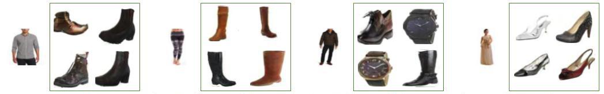

# Compatibility Family Learning for Item Recommendation and Generation


## Prerequisites
- Linux
- Python 3
- CPU or NVIDIA GPU + CUDA CuDNN

## Getting Started
### Installation
- Install Tensorflow from https://www.tensorflow.org/install/

- Install Caffe from http://caffe.berkeleyvision.org/installation.html (for Amazon co-purchase experiments).

- Install Keras from https://keras.io/ (for Polyvore experiments).

- Install python packages
```bash
pip install tqdm
pip install smart-open
pip install boto3
pip install scipy
pip install numpy
```

## Recommendation Experiments

### Fashion-MNIST+1+2 Experiments

1. Run `./experiments/fashion_30/convert_fashion_30.sh`.
2. Run `./experiments/fashion_30/run.sh`.
3. Run `./experiments/fashion_30/eval.sh`.


### Amazon also_veiwed/bought Experiments

1. Put `image_features_Clothing_Shoes_and_Jewelry.b` and `meta_Clothing_Shoes_and_Jewelry.json.gz` from
http://jmcauley.ucsd.edu/data/amazon/ to `data/amazon`.

2. Run `./experiments/monomer/convert_amazon.sh`.

3. Put `also_bought.txt.gz`,  `also_viewed.txt.gz`, `duplicate_list.txt.gz`, `productMeta_simple.txt.gz` from
[Learning Compatibility Across Categories for Heterogeneous Item Recommendation][monomer] (https://sites.google.com/a/eng.ucsd.edu/ruining-he/) into `data/monomer`.

4. Run `./experiments/monomer/unzip_monomer.sh`.

5. Download `Monomer.tar.gz` from [Learning Compatibility Across Categories for Heterogeneous Item Recommendation][monomer]
(https://sites.google.com/a/eng.ucsd.edu/ruining-he/) and put it to `./Monomer`.

6. Run `./experiments/monomer/prepare_monomer.sh`.

7. Run `./experiments/monomer/split_monomer.sh`.

8. Run `./experiments/monomer/process_monomer.sh`.

9. Run `./experiments/monomer/run.sh`.

10. Run `./experiments/monomer/eval.sh`.

[monomer]: https://arxiv.org/abs/1603.09473

### Amazon Co-purchase Experiments

1. Put `train.txt`, `val.txt`, `test.txt`, `train_ids.txt`, `val_ids.txt`, `test_ids.txt` from [Learning Visual Clothing Style with Heterogeneous Dyadic Co-occurrences][dyadic] to `data/dyadic/`;
put `googlenet-siamese-final.caffemodel` into `models/`.

2. Put `metadata.json.gz` from http://jmcauley.ucsd.edu/data/amazon/ to `data/amazon`.

3. Run `./experiments/dyadic/preprocess_dyadic.sh`.

4. Crawl all images from [Learning Visual Clothing Style with Heterogeneous Dyadic Co-occurrences][dyadic] by scrapy, put them on S3.
Check `./data/dyadic/all_id_pairs.txt` for image paths, and see `./experiments/dyadic/amazon_crawler` as an example.

5. Extract images, run `python -m cfl.scripts.copy_images --items-store ITEMS_S3_STORE_PATH --images-store IMAGES_S3_STORE_PATH --output-path IMAGES_S3_PATH --input-file data/dyadic/all_id_pairs.txt`.

6. Fetch images to local, run `aws s3 sync IMAGES_S3_DIR data/dyadic/original_images`.

7. Preprocess dyadic dataset, run `./experiments/dyadic/preprocess_dyadic_latent.sh`.

8. Predict dyadic latents, run `./experiments/dyadic/predict_dyadic_latent.sh` under caffe environment.

9. Convert dyadic dataset, run `./experiments/dyadic/convert_dyadic_latent.sh`.

10. Run `./experiments/dyadic/run.sh`.

11. Run `./experiments/dyadic/eval.sh`.

[dyadic]: https://vision.cornell.edu/se3/projects/clothing-style/

### Polyvore Experiments

1. Crawl all images, put images in `IMAGES_DIR`, items in `ITEMS_S3_STORE_PATH`. See `./experiments/polyvore/polyvore_crawler` as an example.

2. Run `python -m cfl.scripts.preprocess_polyvore --items-store ITEMS_S3_STORE_PATH  --image-dir IMAGES_DIR --output-dir data/polyvore`.

3. Run `python -m cfl.keras.extract_v3 --input-dir data/polyvore/images --output-dir data/polyvore/latents`.

4. Run `./experiments/polyvore/convert_polyvore.sh`.

5. Run `./experiments/polyvore/run.sh`

## Generation Experiments

Note that you must run data preprocesing in the Recommendation section before running these experiments.

### MNIST+1+2 Experiments

1. Run `./experiments/mnist_30/convert_mnist_30.sh`.
2. Run `./experiments/mnist_30/run_gen.sh`.
3. Run `./experiments/mnist_30/run_cgan.sh`.


### Amazon Co-purchase Experiments

1. Convert dyadic dataset, run `./experiments/dyadic/preprocess_dyadic_gen.sh`.

2. Run `./experiments/dyadic/run_gen.sh`.

3. Run `python -m cfl.scripts.convert_disco --input-dir parsed_data/dyadic_gen_all --output-dir parsed_data/dyadic_disco` for DiscoGAN.

4. Run `python -m cfl.scripts.convert_pix2pix --input-dir parsed_data/dyadic_gen_all --disco-dir parsed_data/dyadic_disco --output-dir parsed_data/dyadic_pix2pix` for pix2pix.

5. Run DiscoGAN & pix2pix.

### Polyvore Experiments

1. Run `./experiments/polyvore/run_gen.sh`

2. Run `python -m cfl.scripts.convert_disco --input-dir parsed_data/polyvore_random/top_to_other --output-dir parsed_data/polyvore_random/top_to_other_disco` for DiscoGAN.

3. Run `python -m cfl.scripts.convert_pix2pix --input-dir parsed_data/polyvore_random/top_to_other --disco-dir parsed_data/polyvore_random/top_to_other_disco --output-dir parsed_data/polyvore_random/top_to_other_pix2pix` for pix2pix.

4. Run DiscoGAN & pix2pix.

## Citation
If you use this code for your research, please cite our papers.

```
@inproceedings{shih2018compatibility,
    author = {Shih, Yong-Siang and Chang, Kai-Yueh and Lin, Hsuan-Tien and Sun, Min},
    title = {Compatibility Family Learning for Item Recommendation and Generation},
    booktitle = {Proceedings of the AAAI Conference on Artificial Intelligence (AAAI)},
    pdf = {https://arxiv.org/pdf/1712.01262},
    arxiv = {http://arxiv.org/abs/1712.01262},
    year = {2018},
    month = feb
}
```
